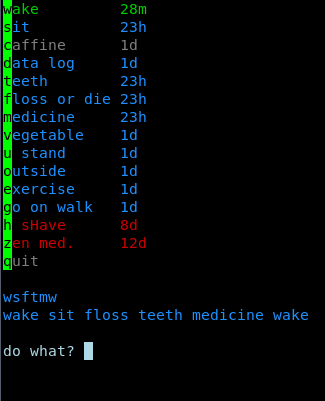
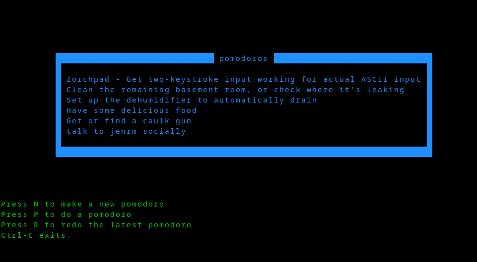
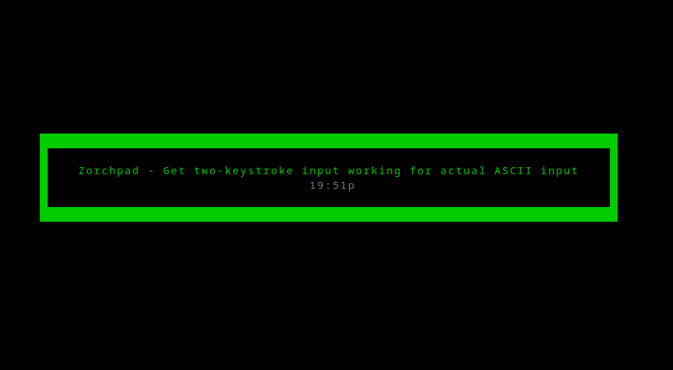

Short Programs
---

A collection of short programs which I wrote and find useful, but don't need their own repository

80-20
---
Takes a set of numbers as input, 1 per line. Outputs the 80-20 tradeoff (20% of the numbers make up 80% of the sum).

Example:

    80-20 file1.dat file2.dat
    seq 1 100 | 80-20

add-base26
---
Adds two lines of english text, mod 26 (ancient-style crypto)

arch-package-summary
---
Lists manually installed packages with descriptions. Both normal and AUR packages are included, but AUR packages are tagged.

asciicam
---
Displays the webcam through ASCII graphics. Just for fun.

battery
---
Displays the current battery percentage as a short string for displays

beepz
---
Sounds beeps, even on devices with beep turned off. Pseudo-rando beeps and says the reason.

Usage:

    beepz "Pomodoro"
    beepz -q "Pomodoro" # Don't use TTS, just beep

budget_summary
---
Helper for za3k only. Summarizes budget categories typed in from my logbook

caesar
---
Does or reverses a classic caesar cipher, in which each letter is shifted a set number of letters through the alphabet.

Usage: `caesar cipher "QEB NRFZH YOLTK CLU GRJMP LSBO QEB IXWV ALD"`

changed-files
---
In Arch Linux, lists the config files which have been altered from the default.

check-if-zeros
---
Checks if a block device (or file) is zero-ed.

Example:

    sudo check-if-zeros /dev/sdb

copy-photo
---
Specific to me. Copies my latest google photo to the clipboard.

countdown
---
See 'timer'

create-github-repo
---
Usage: `create-github-repo NAME DESCRIPTION`

cryptogram.py
---
Usage: `cryptogram.py "MIH WAIHXS TFBFL OF WHLRLTWFS QAFY WIKFIYF CLFECW MIH QTCA LFWRFJC, MIH WAIHXS FVRFJC TC."`

Interactive cryptogram solver.

decolorize
---
Strips ANSI color codes out of a stream

delink
---
Usage: `delink FILE`. Removes a level of symlink, moving the symlink's target in place of the symlink. Can have bad side-effects, use with caution.
See also `mvln`

deshebang
---
Usage: `#!/usr/bin/env deshebang` at the top of a file, makes that file self-printing.

dfa2regex.py
---
Needs to be hand-edited. Makes a regex out of any DFA.

duke2csv
---
Converts 'Usage Report.xml' from Duke energy, to a reasonable CSV format.

Usage: `duke2csv` (in same directory as "Usage Report.xml")

dzen-clock
---
Make a small clock at the bottom of the screen

ebooks-sync
---
Sync books to a FAT filesystem, making sure to rewrite names to be valid for FAT/NTFS.

Example:

    SYNC_DIR="/media/sd" BOOKS_DIR="/home/zachary/books" ebooks-sync

etherpad
---
Create, update, fetch, or delete text files on etherpad.za3k.com (or any other etherpad-lite instance).

    Usage: etherpad put [<pad>]
                    get <pad>
                    delete <pad>

embed-pdf-fonts
---
Embed missing fonts into a PDF.

    Usage: embed-pdf-fonts <PDF>

extract-alarmpi
---
Downloads the latest version of Arch Linux for Raspberry Pi (aka alarmpi) as a .tar.gz file and converts it to an image file which can be copied directly to an SD card.

    Usage: extract-alarmpi [SOURCE.tar.gz [TARGET.img]]

factor
---
Removed. Turns out this is now in coreutils and nearly identical to my program.

fantasy-names
---
Generate some D&D fantasy names. Ported from https://www.fantasynamegenerators.com/, I encourage you to use the original which is much better.

Usage: `fantasy-names`

filter
---
Usage: `cat <stream | filter --negative FILENAME` blacklists anything in FILENAME, there are options for whitelisting and dealing with repeats.

find-git-repos
---
Usage: `find-git-repos DIRECTORY` prints all git repositories found, one per line.

find-mersenne-primes
---
Usage: `find-mersenne-primes` prints the exponents of mersenne primes (prints all N where 2^N-1 is prime). To change search limits edit the file.

fragile-treediff
---
Usage: `fragile-treediff FOLDER1 FOLDER2`
Returns a success or failure error code, depending on whether two folders are exactly identical.

gcode-bounds
---
Usage: `gcode-bounds FILE.gcode`
Returns the dimensions (in mm) of a 3d-printable gcode file.

grep-percent
---
Usage: `grep-percent TERM FILE`
Prints the percentage of lines that match the query (0 to 100)

google
---
Searches for something on google, opening the results page in the default browser.

google-calendar
---
Prints out a physical text-only calendar from Google Calendar

google-count
---
Show the number of results on Google for xkcd-style big data analysis.

Requirements: `pip install beautifulsoup4`

Usage:

    google-count.py "Hello world"
    264000000

habit-tracker
---

Useful only to me. Tracks whether I do things like brush my teeth once a day, shave regularly, etc.

On the left is the habit; on the right is how long since I've done that. You press a single key to say "I did this task". Colors? Red is overdue, blue is "do today", green is "done recently", and grey is "no specific goals".

Usage: `habit-tracker`

hours
---
Reports what hours I was at the computer, based on my bash history. On linux, I instead use [keystroked](https://github.com/vanceza/keystroked).

internet-timelimit
---
(Arch, netcfg) Connects to the internet for short period of time, then automatically disconnects. Usage: `internet.sh MINUTES REASON`

install-yaourt
---
Installs 'yaourt' on arch linux

internet_up?
---
Maintains a file at /var/tmp/internet_up reading "up" or "down". Run as a daemon. Useful for status bars.

last
---
Prints the last line from bash's history

lines
---
Get a slice of lines from a file: `lines <start> <end> <file>` or `cat <file> | lines <start> <end>`.

log
---
Usage:

    log DATASET

Example:

    echo "Backed up the computer." | log backups

lwjgl-fix
---
On Arch Linux, fix lwjgl.jar in minecraft

mailto-opener
---
Open email links in Roundcube. Edit the file to change the URL.

Installation (as default opener):
    
    sudo mailto-opener --install

Usage:

    mailto-opener "mailto:za3k@za3k.com"

math
---
CLI calculator. Outputs the result of simple math expressions (warning: uses 'eval'). Example:

    math 2+2

Outputs:

    2+2 = 4

markov
---
Markov-chain input on a per-word basis

    > curl http://www.ccel.org/ccel/bible/kjv.txt | ./markov # King James Bible
    name resteth and can never a coffin in it; it doth also vanity unto Joseph, I live: and entered into the son of the gate was Jaziz the sons also suck the son of Jehoiada, a sign.
 
    preserved in wait with it.
    
    the
    while they
    prophets?
    our God, the angel, and became a loud voice, that have said, Hearken to me.
    
    concerning his presence; let him to those that is the
    Lord of the solemn feasts, as these things in the
    thou succeedest them, and buy them, Thus saith unto the tribe of
    that thou hast followed

mvln
---
Moves a files, but leaves a symlink pointing to the new location in the old place.
See also `delink`

mux
---
Usage is at the top of a tmux config file:

        #!/usr/bin/env mux

This allows for fast startup, by executing a tmux configuration file as a program.

{brown,pink,white}noise
---
Play randomly-generated noise through the speakers

notify
---
Send a message that gets to me.

Currently shotguns:
- irc
- email
- voice announcement
- on-screen announcement on all my computers
- audible bell ding
- push notification
- text message (sms)

Usage:
    
    cat tasks | xargs && notify "long list of tasks done"

onerng
---
Outputs the (raw) random bytes from an OneRNG hardware device

owns?
---
Checks which Arch Linux package owns a command

passgen
---
Returns a random password or passphrase

Usage:

        passgen [-w|--word] [LENGTH]

pdf-bounding-box
---
Prints the largest page of a PDF, so you know what size paper to print on.

Usage:
        pdf-bounding-box PDF

pdf-strip-last-page
---
Remove the last page of a pdf in-place.

Usage:

        pdf-strip-last-page PDF

ping-test
---
Return true if the internet is up (a single ping to 8.8.8.8 returns).

pompompom
---
Do pomodoros interactively.

Optionally requires 'playsound' from pip

print
---
Usage: `print FILE`

Only useful for me. Prints the file on my printer.

My version of 'lp' doesn't like image files, etc. This converts everything to the correct format using imagemagick.

print.index
---
Prints a file remotely, or prints from stdin if no file is given. Will not work in isolation, needs a remote program

prng
---
Generate a bunch of pseudorandom data. Useful for data integrity tests of storage.

Usage / examples: 

    sudo prng test-usb BLOCKDEVICE
    prng stream SEED | head -c 100 >some_file
    prng stdout SEED [SIZE] | prng verify stdin SEED [SIZE]
    prng file SEED [SIZE]
        prng verify file SEED [SIZE]
    prng files COUNT [SIZE]
        sha256 -c checksums
        prng verify files COUNT [SIZE]
    prng checksums files COUNT [SIZE] > checksums

pull-requester
---
(Obsoleted by git-hub command) Create a new pull request on github for the current github project

pushgh
---
Push to an empty Github repo. Usage: `pushgh [USER] REPOSITORY`

quiz
---
Record daily measurements, etc to a CSV file. Asks questions from the header row of the CSV.

Usage:

    quiz QUESTIONS.csv

random
---
Print a random line out of a file

record-shell
---
Records all interactive shells using [script](https://en.wikipedia.org/wiki/Script_(Unix)). To use, add the magic line given to the top of your .bashrc (record-shell works on all shells, but the invocation line may need to be changed slightly for each shell)

Note that this can record SSH sessions, sudo session etc fine. However by default it does not include input (typed passwords etc).

Records to /var/log/console-recording/$USER/$DATE.log

retry
---
Retry a command 5 times or until it succeeds

roll
---
Rolls D&D dice.

Usage:

    roll "d6 + 4"
    roll d6 + 4
    roll 2d10

Output:

    1d6+4 = 8
    1d6+4 = 6
    2d10+0 = 19

rtmux
---

Usage:

    rtmux HOST
    rtmux-session HOST SESSION-NAME

Attaches to a remote tmux session, or opens one if none exists.

say
---
Read the text aloud. Requires `festival`.

sayfrom
---
Print a stream of text as though in a chat client.

Usage:
    
    sayfrom SPEAKER-NAME [ANSI COLOR CODE]

Example:

    sayfrom Zachary 2 <chat-FIFO

scan-lide
---
Scans a series of pages using the LiDE scanner and 'sane'. Images are auto-cropped using imagemagick if dimensions are not given.

Usage:
    
    scan-lide [DPI] [WIDTH HEIGHT]

Example:

    scan-lide 600dpi 195 155

setop
---
Command-line program for performing basic set operations on lines in files. `comm` can be used for some of this on sorted files but it's a little stronger.

sleep_summary
---
Gives a summary of average and standard deviation of sleep times.

Example:

    sleep_summary 8h40m 5h20m 7h

ssh-quote
---
Like 'ssh', except it handles quoted arguments how you might expect

static-ip
---
Set up a static ip on linux

sum
---
Adds a list of numbers, one per line.

tag_images
---
Tag images in a directory interactively, using 'feh'. One button resizes, another tags the image using an interactive program. I use this for processing scanned images.

timer
---
Kitchen timer for the command line. 'countdown' just displays a time, 'timer' additionally beeps at the end

Example:

    timer 5m30s
    timer "20 minutes" "next pomodoro"
    timer 5m30s

torrent\_size
---
Display the size of a torrent file

unix2date
---
Example:

    $ unix2date 1680474618
    Sun Apr  2 06:30:18 PM EDT 2023

video-linter
---
Check whether videos are correctly renamed and organized. Only useful to me.

watch-to-file
---
Like 'watch', but outputs to a file instead of a TTY

Usage:

    watch-to-file -f FILE [-n INTERVAL] COMMAND

Example:

    watch-to-file -f /var/www/public/pub/status/temp.txt "/usr/local/bin/max-hdd-temp --pretty"

webcam-picture
---
Use the webcam to take a single picture. Usage: `webcam-picture picture.png`

wordcount
---
Counts the number of words in a file or stream.

xadom
---
Runs adom in a fixed-geometry window (because window geometry affects gameplay)

xor
---
Takes the bitwise xor of the given files (or infinite streams), extending all files to the longest length with zeros.

Usage:

    xor [--same-size] FILE1 FILE2 [FILE3...]
    --same-size,    returns nonzero and prints an error message if not all files are the same length

youtube-dl-master
---
Download a youtube file to a 'master' directory, and also to the place specified. Avoids multiple downloads by checking the 'master' directory first. 

Intent is to allow changing the filename format, allowing multiple downloads etc without worrying about duplicates filling up space.

Usage: 

    youtube-dl-master MASTER-DIRECTORY [-t TEMPLATE] -- URLS
    youtube-dl-master MASTER-DIRECTORY [-t TEMPLATE] -- --batch-file FILE

{MASTER-DIRECTORY}/cookies.txt will be used if present
